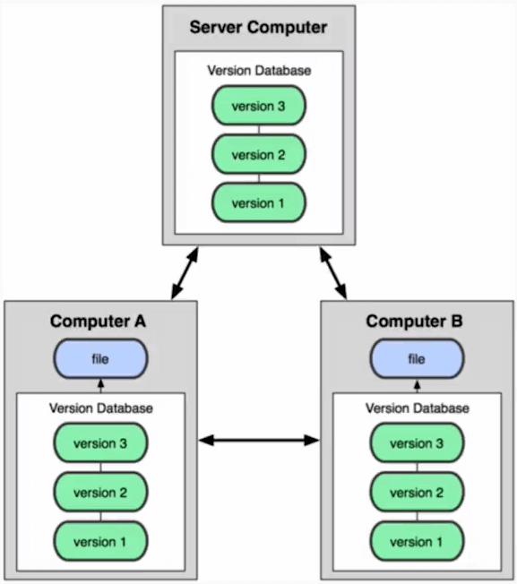
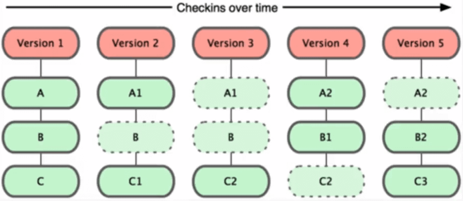

# Curso Profesional de Git y GitHub<!-- omit in toc -->

## Tabla de Contenido<!-- omit in toc -->
- [Aprender y fortalecer conocimientos de GIT](#aprender-y-fortalecer-conocimientos-de-git)
- [Cómo utilizar git y GitHub](#c%c3%b3mo-utilizar-git-y-github)
  - [Flujo básico de git](#flujo-b%c3%a1sico-de-git)
  - [Archivos binarios y de texto plano](#archivos-binarios-y-de-texto-plano)
  - [Diferencias de git contra otros VCS](#diferencias-de-git-contra-otros-vcs)
    - [Ventajas de git contra otros manejadores de versiones](#ventajas-de-git-contra-otros-manejadores-de-versiones)
  - [Operaciones principales de git](#operaciones-principales-de-git)
  - [Commit](#commit)
  - [Archivos trackeados](#archivos-trackeados)
  - [Configurar el entorno de git](#configurar-el-entorno-de-git)
  - [Comandos principales](#comandos-principales)
    - [git init](#git-init)
    - [git add](#git-add)
    - [git commit](#git-commit)
    - [Estado](#estado)
    - [git log](#git-log)
    - [Show](#show)
    - [git diff](#git-diff)
    - [git reset](#git-reset)
    - [Cambiar el editor de código default de git](#cambiar-el-editor-de-c%c3%b3digo-default-de-git)
    - [Eliminar archivos de git](#eliminar-archivos-de-git)
    - [Cambios remotos](#cambios-remotos)
    - [Branchs (Ramas)](#branchs-ramas)
  - [Repositorio remoto (GitHub)](#repositorio-remoto-github)
  - [Llaves públicas y privadas](#llaves-p%c3%bablicas-y-privadas)
    - [Git stash](#git-stash)
    - [git cherry-pick](#git-cherry-pick)
  - [Forks o Bifurcaciones](#forks-o-bifurcaciones)
  - [Trabajando con más de 1 repositorio remoto](#trabajando-con-m%c3%a1s-de-1-repositorio-remoto)
  - [Etiquetas, versiones](#etiquetas-versiones)
  - [Pull request:](#pull-request)
  - [Ignorar archivos para no subirlos al repositorio (.gitignore)](#ignorar-archivos-para-no-subirlos-al-repositorio-gitignore)
  - [Readme.md y markdown](#readmemd-y-markdown)
  - [Git Stash: Guardar cambios en memoria y recuperarlos después](#git-stash-guardar-cambios-en-memoria-y-recuperarlos-despu%c3%a9s)
  - [Stashed area:](#stashed-area)
    - [git stash](#git-stash)
    - [Obtener elelmentos del stash](#obtener-elelmentos-del-stash)
    - [Listado de elementos en el stash](#listado-de-elementos-en-el-stash)
    - [Crear una rama con el stash](#crear-una-rama-con-el-stash)
    - [Eliminar elementos del stash](#eliminar-elementos-del-stash)
  - [Remendar un commit](#remendar-un-commit)
  - [Git nunca olvida, git reflog](#git-nunca-olvida-git-reflog)
  - [Comandos no documentados](#comandos-no-documentados)
- [Versión anterior del curso de GIT](#versi%c3%b3n-anterior-del-curso-de-git)
  - [Sistema de control de versiones](#sistema-de-control-de-versiones)
    - [Tipos de sistemas de control](#tipos-de-sistemas-de-control)
  - [Beneficios de Git](#beneficios-de-git)
  - [Fundamentos de Git](#fundamentos-de-git)
  - [Los 3 estados de Git](#los-3-estados-de-git)
  - [Github](#github)
  - [Configurar Git](#configurar-git)
  - [Comandos de terminal](#comandos-de-terminal)
  - [Comandos Git](#comandos-git)
    - [Flujos de Trabajo](#flujos-de-trabajo)
    - [Múltiples entornos de trabajo](#m%c3%baltiples-entornos-de-trabajo)
  - [Repositorios Remotos (Github)](#repositorios-remotos-github)
  - [Configuraciones de Github](#configuraciones-de-github)
    - [Notificaciones](#notificaciones)
    - [Proteger un branch](#proteger-un-branch)
    - [Plantillas](#plantillas)
    - [Ignorar archivos](#ignorar-archivos)
    - [Issues y Milestones](#issues-y-milestones)
    - [Hosting Gratuito de archivos en GitHub](#hosting-gratuito-de-archivos-en-github)
    - [Dominios personalizados en GitHub](#dominios-personalizados-en-github)
    - [GitHub Desktop, todo lo que necesitas de Git en una sola herramienta gráfica](#github-desktop-todo-lo-que-necesitas-de-git-en-una-sola-herramienta-gr%c3%a1fica)
  - [Recursos Complementarios](#recursos-complementarios)
  - [Enlaces de Interés](#enlaces-de-inter%c3%a9s)

# Aprender y fortalecer conocimientos de GIT

<a href="https://learngitbranching.js.org/">Learn Git Branch</a>

<div align="right">
  <small><a href="#tabla-de-contenido">🡡 volver al inicio</a></small>
</div>

# Cómo utilizar git y GitHub

Este repositorio sirve como resúmen del [curso de Git y github de Platzi](https://platzi.com/github), por [Freddy Vega](https://github.com/freddier/hyperblog).

**Git** es un sistema de control de versiones (**VCS version control system**), 

Registra los **cambios** realizados sobre un archivo o conjunto de archivos a lo largo del **tiempo**, por lo tanto no tendrás versiones como 

* tarea.txt
* tarea2.txt
* tarea2-final.txt 
* tarea2-final2.txt 
* tarea2-final2-esteeselbueno.txt 

Además de que envés de guardar los archivos completos se guardan **sólo los cambios**.

Git es algo así como el `Ctrl+Z` (deshacer) de los programadores, suponiendo que el `Ctrl Z` guardara todo el **historial de modificación** de los archivos, ya que con git puedes moverte en la historia (algo así como una máquina del tiempo).

<div align="right">
  <small><a href="#tabla-de-contenido">🡡 volver al inicio</a></small>
</div>


## Flujo básico de git

El flujo normal de git es el siguiente:

`git init`: Empiezas un repositorio

`git add archivo.txt`: Agregas los cambios del archivo.txt al **staging area** para decirle a git que se prepare para guardar los cambios

`git commit -m 'Descripción del commit'`: Guarda los cambios en la base de datos del VCS (creando una nueva versión)

**Tipos de Control de versiones:**

* **Local:** Sólo funciona en una sóla máquina, es útil, pero no incorpora la colaboración.
* **Centralizado (en un sólo servidor):** Toda la información está depositada en un sólo repositorio, lo que hace que el trabajo se maneje directamente en el servidor. 
* **Distribuído:** La información se encuentra respaldada en diferentes peers, diferentes servidores y/o diferentes máquinas, lo que permite trabajar y compartir de manera sencilla.

<div align="right">
  <small><a href="#tabla-de-contenido">🡡 volver al inicio</a></small>
</div>

## Archivos binarios y de texto plano

Git permite guardar tanto binarios como archivos de texto plano, pero está diseñado para modificar archivos de texto plano, ¿la razón? como git guarda los cambios entre versiones en el tiempo, son prácticamente no rastreables los cambios entre una versión y otra de un binario, mientras que son muy transparentes en los archivos de texto plano.

<div align="right">
  <small><a href="#tabla-de-contenido">🡡 volver al inicio</a></small>
</div>


## Diferencias de git contra otros VCS

- Git guarda referencia a los archivos no cambiados
- Trabajo online efectivo
- Git tiene Integridad: No puedes perder información durante su transmición

<div align="right">
  <small><a href="#tabla-de-contenido">🡡 volver al inicio</a></small>
</div>


### Ventajas de git contra otros manejadores de versiones

* Veloz
* Diseño sencillo
* Fuerte apoyo del desarrollo no lineal
* Completamente distribuido
* Capaz de manejar grandes proyectos

<div align="right">
  <small><a href="#tabla-de-contenido">🡡 volver al inicio</a></small>
</div>


## Operaciones principales de git

Es importante saber cuál es el estatus de tus cambios, ya que al modificar un archivo, éste no por defecto se va a git, sino que se modifica en el **working directory**, para que sea trackeado por git debe de pasar por el **staging area** y llegar al **repositorio**, opcionalmente podría llegar al **repositorio remoto**. A continuación más detalle.

* **Working directory (Local):** El working directory es el espacio de trabajo no rastreado por git, al modificar un archivo, este se modificará en el working directory andtes de que le des `git add` para agregarlo al staging area.

* **Staging Area:** Es un espacio en memoria ram dónde están guardados los cambios, pero todavía no están en el repositorio (no son trackeados por git). para agregar al staging area se utiliza el comando `git add`

  ```bash
  git add archivo.txt #Agrega el archivo.txt al staging area
  git add . #Agrega todos los cambios de los archivos en las subcarpetas del directorio en el que te encuentras al staging area
  git add -A #Agrega todos los cambios del repositorio en el que estás trabajando al staging area
  ```

* **Git repository:** Es el lugar dónde se trackean los cambios, cuando algo está en el repositorio, ya está en la historia de git y puedes acceder a ese historial mediante los commits. `git commit`

  ```bash
  git commit -m 'Commit 1' #Crea un commit (sube los cambios al repositorio local) con el nombre 'Commit 1'
  git commit #Se prepara para hacer commit y abre el editor por defecto de la terminal para ponerle nombre
  ```

  Es una buena práctica ser descriptivos con los cambios que se hicieron en cada commit.

* **Remote repository**: Acá entra github, el repositorio remoto es una copia de tu repositorio local, pero en Internet. Para mandar cambios al repositorio remoto es con el comando `git push`

  ```bash
  git push origin master #Empuja (envía) los cambios de la rama master al servidor remoto 'origin' 
  ```

<div align="right">
  <small><a href="#tabla-de-contenido">🡡 volver al inicio</a></small>
</div>


## Commit

Un commit es un cambio rastreable (de 1 o varios archivos), es confirmar un conjunto de cambios provisionales de forma permanente y tenemos el superpoder de ponerle nombre a este cambio.

La historia de tu desarrollo se van guardando mediante commits, ya que cada cambio confirmado tiene modificaciones importantes hasta llegar al cambio actual.

Para hacer un commit, es muy sencillo, tenemos que tener agregado en el staging (`git add -A`) y usar el comando commit

```bash
Git commit -m 'commit'
```

Si trabajamos en algo experimental o que no queremos que sea parte del flujo principal, podemos hacer una nueva rama (**branch**), recordemos que la rama principal suela llamarse **master**, por lo tanto ésta branch nueva tendrá su propia historia (posterior al punto donde se creó).

Para crear una rama nueva con la información de la rama actual usamos el comando

```bash
git checkout -b nombre-del-branch
```

Si los cambios que realizaste en tu rama nueva son un avance en el código, puedes fusionarlo a la rama master (o a otra), para ésto tienes que cambiarte a master y hacer el comando es `merge`

```bash
git checkout master # nos cambiamos a la rama master
git merge rama-nueva # Fusionamos los cambios de la 'rama-nueva' en master
```

<div align="right">
  <small><a href="#tabla-de-contenido">🡡 volver al inicio</a></small>
</div>


## Archivos trackeados

- **Archivos Tracked**: Son los archivos que viven dentro de Git, no tienen cambios pendientes y sus últimas actualizaciones han  sido guardadas en el repositorio gracias a los comandos `git add` y `git commit`.
- **Archivos Staged**: Son archivos en Staging. Viven dentro de Git y hay registro de ellos porque han sido afectados por el comando `git add`, aunque no sus últimos cambios. Git ya sabe de la existencia de estos  últimos cambios pero todavía no han sido guardados definitivamente en el repositorio porque falta ejecutar el comando `git commit`.
- **Archivos Unstaged**: Entiendelos como archivos *“Tracked pero Unstaged”*. Son archivos que viven dentro de Git pero no han sido afectados por el comando `git add` ni mucho menos por `git commit`. Git tiene un registro de estos archivos pero está desactualizado, sus últimas versiones solo están guardadas en el disco duro.
- **Archivos Untracked**: Son archivos que NO viven dentro de Git, solo en el disco duro. Nunca han sido afectados por `git add`, así que Git no tiene registros de su existencia.

<div align="right">
  <small><a href="#tabla-de-contenido">🡡 volver al inicio</a></small>
</div>


## Configurar el entorno de git

Para configurar la información del usuario global de git de tu máquina deberás de utilizar el comando `git config` declarando que modificaras de manera `--global` la variable (`email` o `name`) de tú `user` lo que significa que estarás definiendo qué usuario está utilizando git en tu máquina (que firma su autenticidad)

```bash
git config --global user.email "tu@email.com" # Configura el correo del usuario de git 
git config --global user.name "Tu Nombre" # Configura el nombre del usuario de git 
git config --list --show-origin
```

Llaves SSH

```bash
ssh-keygen -t rsa -b 4096 -C "email@dominio.org"
```

<div align="right">
  <small><a href="#tabla-de-contenido">🡡 volver al inicio</a></small>
</div>


## Comandos principales

### git init

Con git init creas un entorno de trabajo para git, además de la carpeta oculta .git, dónde se guardará toda la información relevante al control de versiones, es muy sencillo, en un directorio que no esté trackeado por git usa el comando `git init`

```bash
git init #Empiezas un repositorio
```

### git add

Git add agrega los archivos y carpetas que elijas al staging area, que es como el espacio en memoria ram donde están los cambios que se van a subir en el futuro.

```bash
git add <archivo.txt> # Agregas los cambios del archivo.txt al **staging area** para decirle a git que se prepare para guardar los cambios
git add -A # Agregas todos los cambios al staging area
git add . # Agregas los cambios de los subdirectorios de la carpeta en la que te encuentras
```

### git commit

Graba los cambios que están en el `staging area` en el `repositorio`.

```bash
git commit #Se prepara para hacer commit y abre el editor por defecto de la terminal para ponerle nombre
git commit -m 'Descripción del commit': #Guarda los cambios en la base de datos del VCS (creando una nueva versión)
git commit --amend:
```

### Estado

Muestra el estado del working directory, muestra si hay cambios en el working directory sin agregar, o si hay algo en el staging area sin que se haya hecho un commit.

```bash
git status
```

### git log

Te muestra el historial de los commits que has hecho

```bash
git log # Muestra todos los commits con la información default
git log -3 #ultimos tres commits
git log --oneline #Resumido
git log --oneline --graph
git log -p #Revisar los cambios de los archivos de los commits
git log --all #Revisar todos los cambios hechos historicamente por todos en el repositorio
git log --all --graph #Revisar todos pero con grafos visual
git log --all --graph --decorate --oneline Revisar todos los cambios con grafos y de manera comprimida

```

Crear un alias en terminal linux(windows=gitbash o bash(linux subsystem)
```bash
alias nombre="comando que tu quieras"
alias arbolito="git log --all --graph --decorate --oneline"
```

### Show

Muestra el mensaje del último commit y la diferencia textual. Es como log, pero con la diferencia de que muestra los cambios precisos que se hicieron en el commit

```bash
git show
```

### git diff

Nos compara y muestra los cambios sufridos entre los dos commits. Los id de los commit se pueden encontrar ejecutando git log.

```bash
git diff <referenci sha1> #
git diff <referencia2> <referencia1> <archivo>
```

### git reset
Lo que hace es que nosotros volvemos a un punto de las versiones que tengamos en nuestro repositorio(local o remoto) y empezamos desde el punto en el cual nosotros queramos

```bash
git reset --soft #Agrega al staging
git reset --mixed #No lo agrega al staging
git reset --hard #Borra prácticamente todo lo que se haya hecho 
git reset HEAD
anteriormente y queda como la master(principal) con la versión asignada
```

### Cambiar el editor de código default de git

```bash
git config --global core.editor “nano --wait”
```

### Eliminar archivos de git
Para eliminar archivos de git(Rastreados o Tracking) sin eliminar el historial de cambios hechos en él de tal forma que en cualquier momento podemos volver a recuperar estos archivos desde el último commit hecho antes de borrar el archivo en cuestión.
```bash
git rm file
```
Para eliminar los archivos en el area de preparación(Stagin) y del próximo commit pero manteniéndolos en nuestro disco duro(Osea en memoria de nuestro equipo)
```bash
git rm --cached file
```

Para eliminar los archivos rastreados por git y del disco duro
```bash
git rm --force file
```
Recibir un cambio del repositorio remoto pero no te los copia con los archivos actuales(tu almacenamiento local) y para que obtengas los cambios necesitamos hacer un merge

### Cambios remotos

```bash
git fetch origin master
git merge FETCH_HEAD
```
git fetch -> Traer los datos nuevos que hay en el repositorio remoto

Esto nos traera algo llamado FETCH_HEAD(apunta a la cabeza actual(rama)) y tendremos que hacer un merge a el con:

git merge -> Traspasar los cambios recibidor por el fetch y añadirlos a tus archivos o en su defecto agregar de los cambios hechos en el repositorio

### Branchs (Ramas)

Versiones alternas de un proyecto

```bash
git branch nombre 
git branch -d nombre # Eliminar rama
git branch -D nombre # Forzar eliminado de rama
git branch -m nombre_viejo nombre_nuevo # Cambiar nombre de la rama
git checkout #cambiar de ramas
git checkout cambio_rama # Cambiar a la rama <cambio_rama>
git checkout -b nueva-imagen # Crear rama <nueva-imagen> y switchear a ésta
git merge <rama-arreglada> # mezclando la rama actual con la <rama-arreglada> 
# Tenemos que estar en la rama output para hacer un merge o un rebase
git merge --abort
git rebase # hace prácticamente lo mismo que merge, cambiamos la historia de nuestro proyecto sin crear bifurcaciones del proyecto. Es mejor usar merge, 
#Usar solo git rebase de manera local.
```

## Repositorio remoto (GitHub)

GitHub es un sistema online de manejo de repositorios de Git, es el cliente de git más popular, tanto que, se podría decir que es la red social del código, ésto porque te permite tener tus repositorios en la nube, tener un perfil profesional (con los aportes, tus repositorios y demás información de tu vidad de programador) y todo con un núcleo de git por dentro.

Como git es un VMS distribuído, entonces el código funciona en diferentes servidores (máquinas), pero para que vinculemos un servidor remoto tenemos que configurar un origen que indique con qué repositorio remoto estaremos trabajando, básicamente es una sintaxis que nos indica que le vamos a poner un pseudónimo a la url de dónde vamos a trabajar.

El comando para agregar un orígen remoto es:

```bash
git remote add origin <url_repositorio>
```

Donde:

* **git remote** = El comando que indica que vamos a trabajar con un servidor remoto
* **add** = Agrega un alias para el servidor remoto
* **origin** = Es el alias del servidor remoto (ésto para no tener que poner la url completa cada que quieres hacer un cambio)
* **<url_repositorio>** = Es la url dónde está el repositorio en la nube, en este caso de github (https://github.com/<tu_usuario_de_github>/<nombre_de_tu_repositorio>)

Ya que agregaste tu servidor remoto `origin` puedes jalaro o empujar los cambios, osea sincronizar tu servidor remoto con el local, para eso tenemos 2 comandos

* git pull: Jala los cambios del servidor, pero cómo podemos tener configurados diferentes repositorios remotos, tenemos que definir de dónde lo vamos a bajar y qué rama vamos a bajar, para eso podemos utilizar el siguiente comando:

  ```bash
  git pull <remoto> <rama>
  ```

  En el caso de la rama master y el remoto origin:

  ```bash
  git pull origin master
  ```

  Ésto bajará todos los cambios a tu local, pero si de pura casualidad la historia es diferente (el repositorio remoto tiene commits diferentes, puede ser un Readme nuevo) tienes que forzar bajar los cambios con el flag `--allow-unrelated-histories`.

  ```bash
  git pull origin master --allow-unrelated-histories
  ```

* git push: Empuja los cambios desde el local al remoto.

  ```bash
  git push <remote> <rama>
  ```

  La sintaxis es la misma que para el pull:

  ```bash
  git push origin master
  ```

<div align="right">
  <small><a href="#tabla-de-contenido">🡡 volver al inicio</a></small>
</div>


## Llaves públicas y privadas

Es un problema guardar el usuario y la contraseña de tu cuenta de github en tu máquina porque puede ser extraído si alguien accede a tu equipo, para eso podemos cifrar tu identidad con el algoritmo de Llaves públicas y privadas (o Cifrado asimétrico de un sólo camino )

Este algoritmo sirve para mandar mensajes privados entre varios nodos con la lógica de que firmas tu mensaje con una llave pública vinculada con una llave privada que puede leer el mensaje.

El flujo es:

1. Creas una llave pública y una llave privada (ambas están vinculadas)
2. Cifras el mensaje con la llave pública (puede ser llave de otra persona)
3. Envías el mensaje
4. El receptor, al tener la llave privada puede descifrar el mensaje.

Este algoritmo es completamente seguro, así es cómo se mandan las comunicaciones en bancos, la comunicación entre servidores o las firmas electrónicas.

<div align="right">
  <small><a href="#tabla-de-contenido">🡡 volver al inicio</a></small>
</div>


### Git stash

git stash: es otro de los limbos, como el staging area. Para agregar los cambios estos deben estar en el staging area.
git stash list: nos muestra la lista de stash que tengamos.
git stash drop stash@{numero}: nos permite borrar un stash.
git stash apply: aplicamos el último cambio
Guardar en el limbo los cambios

git stash
git stash drop <numero_estado> #eliminar un stash
git stash apply #Agrega el estado ultimo
git stash apply <estado> #agregar stash exacto

<div align="right">
  <small><a href="#tabla-de-contenido">🡡 volver al inicio</a></small>
</div>


### git cherry-pick 

Escoger commits
git cherry-pick [SHA1] nos permite cambiar un commit a otra rama para salvarnos la vida.
Vim
:wq #guardar y salir

MAC
pbcopy < “archivo”

<div align="right">
  <small><a href="#tabla-de-contenido">🡡 volver al inicio</a></small>
</div>


## Forks o Bifurcaciones

Es una característica única de GitHub en la que se crea una copia exacta del estado actual de un repositorio público a mis repositorios en Github, éste repositorio podrá servir como otro origen y se podrá clonar (como cualquier otro repositorio), en pocas palabras, lo podremos utilizar como un git cualquiera.

Copiar un repositorio público a mis repositorios en Github, con todas sus ramas e historia anterior

Un fork es como una bifurcación del repositorio completo, tiene una historia en común, pero de repente se bifurca y pueden variar los cambios, ya que ambos proyectos podrán ser modificados en paralelo y para estar al día un colaborador tendrá que estar actualizando su fork con la información del original.

Al hacer un fork de un poryecto en GitHub, te conviertes en dueñ@ del repositorio fork, puedes trabajar en éste con todos los permisos, pero es un repositorio completamente diferente que el original, teniendo alguna historia en común.

Los forks son importantes porque es la manera en la que funciona el open source, ya que, una persona puede no ser colaborador de un proyecto, pero puede contribuír al mismo, haciendo mejor software que pueda ser utilizado por cualquiera.

Al hacer un fork, GitHub sabe que se hizo el fork del proyecto, por lo que se le permite al colaborador hacer pull request desde su repositorio propio.

<div align="right">
  <small><a href="#tabla-de-contenido">🡡 volver al inicio</a></small>
</div>


## Trabajando con más de 1 repositorio remoto

Cuando trabajas en un proyecto que existe en **diferentes repositorios remotos** (normalmente a causa de un **fork**) es muy probable que desees poder **trabajar con ambos repositorios**, para ésto puedes crear un **remoto adicional** desde consola.

```bash
git remote add <nombre_del_remoto> <url_del_remoto> 
```

```bash
git remote upstream https://github.com/freddier/hyperblog
```

Al crear un **remoto adicional** podremos, hacer **pull** desde el nuevo **origen** (en caso de tener permisos podremos hacer fetch y push)

```bash
git pull <remoto> <rama>
```

```bash
git pull upstream master
```

Éste `pull` nos traerá los **cambios del remoto**, por lo que se estará al día en el proyecto, el flujo de trabajo cambia, en adelante se estará trabajando haciendo **pull desde el upstream** y **push al origin** para pasar a hacer **pull request**.

```bash
git pull upstream master
git push origin master
```

<div align="right">
  <small><a href="#tabla-de-contenido">🡡 volver al inicio</a></small>
</div>


## Etiquetas, versiones

Comandos para trabajar con etiquetas:

- Crear un nuevo tag y asignarlo a un commit: 

  ```bash
  git tag -f -a <version-nueva> -m  <Comentario> <version>
  git tag -f -a nombre-del-tag id-del-commit
  ```

* Borrar un tag en el repositorio local: 

  ```bash
  git tag -d nombre-del-tag
  ```

- Listar los tags de nuestro repositorio local: 

  ```bash
  git tag
  git show-refs --tags
  ```

- Publicar un tag en el repositorio remoto

  ```bash
  git push origin --tags
  ```

- Borrar un tag del repositorio remoto: 

  ```bash
  git tag -d nombre-del-tag # Borrar los tags en local
  git push origin :refs/tags/nombre-del-tag # Borrar los tags en remoto
  ```

<div align="right">
  <small><a href="#tabla-de-contenido">🡡 volver al inicio</a></small>
</div>


## Pull request: 

Es una funcionalidad de github (en gitlab llamada merge request y en bitbucket push request), en la que un colaborador pide que revisen sus cambios antes de hacer merge a una rama, normalmente master.

Al hacer un pull request se genera una conversación que pueden seguir los demás usuarios del repositorio, así como autorizar y rechazar los cambios.

El flujo del pull request es el siguiente

1. Se trabaja en una **rama paralela** los cambios que se desean (`git checkout -b <rama>`)
2. Se hace un **commit** a la rama (`git commit -am '<Comentario>'`)
3. Se **suben** al **remoto** los **cambios** (`git push origin <rama>`)
4. En GitHub se hace el `pull request` comparando la **rama master** con la rama del **fix**.
5. Uno, o varios colaboradores  revisan que el **código sea correcto** y dan **feedback** (en el chat del pull request)
6. El colaborador hace los cambios que desea en la **rama** y lo **vuelve a subir** al remoto (automáticamente jala la historia de los cambios que se hagan en la rama, en remoto)
7. Se **aceptan los cambios** en GitHub
8. Se hace **merge** a `master` desde GitHub

**Importante**: Cuando se modifica una `rama`, también se modifica el `pull request`

<div align="right">
  <small><a href="#tabla-de-contenido">🡡 volver al inicio</a></small>
</div>


## Ignorar archivos para no subirlos al repositorio (.gitignore)

Por diversas razones, **no todos los archivos** que agregas a un proyecto **deberían guardarse** en un  repositorio, ésto porque hay archivos que no todo el mundo debería de ver, y hay archivos que al estar en el repositorio alentan el proceso de desarrollo (por ejemplo los binary large objects, blob, que se tardan en descargarse).

Para que no se suban estos archivos no deseados se puede crear un archivo con el nombre `.gitignore` en la raíz del repositorio con las reglas para los archivos que no se deberían subir (ver [sintaxis de los .gitignore](https://git-scm.com/docs/gitignore).

Las razones principales para tomar la decisión de no agregar un archivo a un repositorio son:

* Es un archivo con contraseñas (normalmente con la extensión `.env`)
* Es un blob (binary large object, objeto binario grande), mismos que son difíciles de gestionar en git.
* Son archivos que se generan corriendo comandos, por ejemplo la carpeta `node_modules` que genera npm al correr el comando `npm install`

<div align="right">
  <small><a href="#tabla-de-contenido">🡡 volver al inicio</a></small>
</div>


## Readme.md y markdown

`README.md`  es el lugar dónde se explica de qué trata el proyecto, cómo utilizarlo y demás información que se considere que se deba conocer antes de utilizar un proyecto.

Los archivos README son escritos en un lenguaje llamado [**markdown**](https://www.markdownguide.org/getting-started/), por eso la extensión `.md`.

Los `README.md` pueden estar en todas las carpetas, pero el más importante es el que se encuentra en la raíz y ayudan a que los colaboradores sepan información importante del proyecto, módulo o sección, puedes crear cualquier cualquier archivo con la extensión `.md` pero sólo losn `README.md` los mostrará por defecto GitHub.

<div align="right">
  <small><a href="#tabla-de-contenido">🡡 volver al inicio</a></small>
</div>


## Git Stash: Guardar cambios en memoria y recuperarlos después

Cuando necesitamos regresar en el tiempo porque borramos alguna línea de  código pero no queremos pasarnos a otra rama porque nos daría un error  ya que debemos pasar ese “mal cambio” que hicimos a stage, podemos usar `git stash` para regresar el cambio anterior que hicimos.

`git stash` es típico cuando estamos cambios que no merecen una rama o no merecen un *rebase* si no simplemente estamos probando algo y luego quieres volver rápidamente a tu versión anterior la cual es la correcta.

<div align="right">
  <small><a href="#tabla-de-contenido">🡡 volver al inicio</a></small>
</div>


## Stashed area:

El stashed nos sirve para guardar cambios para después, Es una lista de estados que nos guarda algunos  cambios que hicimos en Staging para poder cambiar de rama sin perder el trabajo que todavía  no guardamos en un commit

Ésto es especialmente útil porque hay veces que no se permite cambiar de rama, ésto porque porque tenemos cambios sin guardar, no siempre es un cambio lo suficientemente bueno como para hacer un commit, pero no queremos perder ese código en el que estuvimos trabajando.

El stashed nos permite cambiar de ramas, hacer cambios,  trabajar en otras cosas y, más adelante, retomar el trabajo con los  archivos que teníamos en Staging pero que podemos recuperar ya que los  guardamos en el Stash.

<div align="right">
  <small><a href="#tabla-de-contenido">🡡 volver al inicio</a></small>
</div>


### git stash

El comando git stash guarda el trabajo actual del Staging en una lista diseñada para ser temporal llamada Stash, para que pueda ser recuperado en el futuro.

Para agregar los cambios al stash se utiliza el comando:

```bash
git stash
```

Podemos poner un mensaje en el stash, para asi diferenciarlos en git stash list por si tenemos varios elementos en el stash. Ésto con:

```
git stash save "mensaje identificador del elemento del stashed"
```

<div align="right">
  <small><a href="#tabla-de-contenido">🡡 volver al inicio</a></small>
</div>


### Obtener elelmentos del stash

El stashed se comporta como una [Stack](https://es.wikipedia.org/wiki/Pila_(informática)) de datos comportándose de manera tipo [LIFO](https://es.wikipedia.org/wiki/LIFO) (del inglés *Last In, First Out*, «último en entrar, primero en salir»), así podemos acceder al método pop.

El método **pop** recuperará y sacará de la lista el **último estado del stashed** y lo insertará en el **staging area**, por lo que es importante saber en qué branch te encuentras para poder recuperarlo, ya que el stash será **agnóstico a la rama o estado en el que te encuentres**, siempre recuperará los cambios que hiciste en el lugar que lo llamas.

Para recuperar los últimos cambios desde el stash a tu staging area utiliza el comando: 

```bash
git stash pop
```

Para aplicar los cambios de un stash específico y eliminarlo del stash:

```bash
git stash pop stash@{<num_stash>}
```

Para retomar los cambios de una posición específica del Stash puedes utilizar el comando:

```bash
git stash apply stash@{<num_stash>}
```

Donde el `<num_stash>` lo obtienes desden el `git stash list`

<div align="right">
  <small><a href="#tabla-de-contenido">🡡 volver al inicio</a></small>
</div>


### Listado de elementos en el stash

Para ver la lista de cambios guardados en Stash y así poder recuperarlos o hacer algo con ellos podemos utilizar el comando:

```bash
git stash list
```

Retomar los cambios de una posición específica del Stash || Aplica los cambios de un stash específico

<div align="right">
  <small><a href="#tabla-de-contenido">🡡 volver al inicio</a></small>
</div>


### Crear una rama con el stash

Para crear una rama y aplicar el stash mas reciente podemos utilizar el comando

```bash
git stash branch <nombre_de_la_rama>
```

Si deseas crear una rama y aplicar un stash específico (obtenido desde `git stash list`) puedes utilizar el comando:

```bash
git stash branch nombre_de_rama stash@{<num_stash>}
```

Al utilizar estos comandos **crearás una rama** con el nombre `<nombre_de_la_rama>`, te pasarás a ella y tendrás el **stash especificado** en tu **staging area**.

<div align="right">
  <small><a href="#tabla-de-contenido">🡡 volver al inicio</a></small>
</div>


### Eliminar elementos del stash

Para eliminar los cambios más recientes dentro del stash (el elemento 0), podemos utilizar el comando:

```bash
git stash drop
```

Pero si en cambio conoces el `índice` del stash que quieres borrar (mediante `git stash list`) puedes utilizar el comando:

```bash
git stash drop stash@{<num_stash>}
```

Donde el `<num_stash>` es el `índice` del cambio guardado.

Si en cambio deseas eliminar todos los elementos del stash, puedes utilizar:

```bash
git stash clear
```

Consideraciones:

- El cambio más reciente (al crear un stash) **SIEMPRE** recibe el valor 0 y los que estaban antes aumentan su valor.
- Al crear un stash tomará los archivos que han sido modificados y  eliminados. Para que tome un archivo creado es necesario agregarlo al  Staging Area con git add [nombre_archivo] con la intención de que git  tenga un seguimiento de ese archivo, o también utilizando el comando git stash -u (que guardará en el stash los archivos que no estén en el staging).
- Al aplicar un stash este no se elimina, es buena práctica eliminarlo.

<div align="right">
  <small><a href="#tabla-de-contenido">🡡 volver al inicio</a></small>
</div>


## Remendar un commit

Puede modificar el commit más reciente (enmendar) en la misma rama ejecutando:

```bash
git add -A # Para hacer uso de ammend los archivos deben de estar en staging
git commit --amend # Remendar último commit
```

Este comando sirve para agregar archivos nuevos o actualizar el commit anterior y no generar commits innecesarios. 

También es una forma sencilla de **editar o agregar comentarios al commit anterior** porque abrirá la consola para editar el commit anterior.

**Nota**: Es una **mala práctica** hacer ammend de un commit que ya ha sido **pusheado o pulleado** del repositorio remoto, al momento de hacer ammend con algún `commit` que esté en remoto va a generar un **conflicto** que se va a arreglar haciendo un `commit adicional` y se **perderá el beneficio** del ammend.

<div align="right">
  <small><a href="#tabla-de-contenido">🡡 volver al inicio</a></small>
</div>


## Git nunca olvida, `git reflog`

Git guarda todos los cambios aunque decidas borrarlos, al borrar un cambio lo que estás haciendo sólo es actualizar la punta del branch, para gestionar éstas puntas existe un mecanismo llamado registros de referencia o `reflogs`.

La gestión de estos cambios es mediante los hash'es de referencia (o `ref`) que son apuntadores a los commits.

Los recoges registran cuándo se actualizaron las referencias de Git en el repositorio local (sólo en el local), por lo que si deseas ver cómo has modificado la historia puedes utilizar el comando:

```bash
git reflog
```

Muchos comandos de Git aceptan un parámetro para especificar una referencia o "ref", que es un puntero a una confirmación sobre todo los comandos:

- `git checkout` Puedes moverte sin realizar ningún cambio al commit exacto de la `ref`

  ```bash
  git checkout eff544f
  ```

- `git reset`: Hará que el último commit sea el pasado por la `ref`, usar este comando sólo si sabes exactamente qué estás haciendo

  ```bash
  git reset --hard eff544f # Perderá todo lo que se encuentra en staging y en el Working directory y se moverá el head al commit eff544f
  git reset --soft eff544f # Te recuperará todos los cambios que tengas diferentes al commit eff544f, los agregará al staging area y moverá el head al commit eff544f
  ```

- `git merge`: Puedes hacer merge de un commit en específico, funciona igual que con una branch, pero te hace el merge del estado específico del commit mandado

  ```bash
  git checkout master
  git merge eff544f # Fusionará en un nuevo commit la historia de master con el momento específico en el que vive eff544f
  ```

<div align="right">
  <small><a href="#tabla-de-contenido">🡡 volver al inicio</a></small>
</div>


## Comandos no documentados

```bash
git config --global alias.platzi "shortlog"
```

```bash
ssh-keygen -t rsa -b 4096 -C "davbelom@gmail.com"
```

<div align="right">
  <small><a href="#tabla-de-contenido">🡡 volver al inicio</a></small>
</div>


# Versión anterior del curso de GIT

## Sistema de control de versiones

Un sistema que registra los cambios realizados sobre un archivo o conjunto de archivos a lo largo del tiempo. Este tipo de sistemas nos permiten volver en el tiempo y salvar nuestro trabajo.

<div align="right">
  <small><a href="#tabla-de-contenido">🡡 volver al inicio</a></small>
</div>

### Tipos de sistemas de control

`Local Computer` Solo vive en nuestro computador.

<div align="center">
  
  <small><p>Sistema de Control Local</p></small>
</div>

`Centralizado` No depende únicamente de un computador en el que se trabaja, sino que depende del súper servidor en donde se almacena la información. El servidor provee las copias a sus hijos, pero solo guarda los cambios en un solo lugar.

<div align="center">
  
  <small><p>Sistema de Control Centralizado</p></small>
</div>

`Sistema de control distribuidos` Cada uno de los que participan en el proyecto, tienen copia del proyecto que se realiza, por eso no dependemos de un solo computador que almacene toda la información.

<div align="center">
  
  <small><p>Sistema de Control Distribuido</p></small>
</div>

Git es un Sistema de Control de Versiones Distribuido.

Git fue creado por Linus Torvals

<div align="right">
  <small><a href="#tabla-de-contenido">🡡 volver al inicio</a></small>
</div>

## Beneficios de Git

* `Velocidad` Puedes trabajar fluidamente desde tu computador.
* `Diseño sencillo` El codigo es robusto con las herramientas necesarias, como viajar en el tiempo.
* `Fuerte apoyo en el desarrollo no lineal` No trabaja de manera lineal, la linea del tiempo tiene bifurcaciones de manera independiente al proyecto principal.
* `Completamente distribuido` Cada quien puede tener una copia del proyecto.
* `Capaz de manejar grandes proyectos` Linux, Django, Laravel, etc. Usan git.

<div align="right">
  <small><a href="#tabla-de-contenido">🡡 volver al inicio</a></small>
</div>

## Fundamentos de Git

* Git almacena una referencia a todos los archivos que no se han cambiado
* Casi cualquier operación en Git es local. Se puede trabajar offline
* Git tiene integridad. No puedes perder información durante su transmisión o sufrir corrupción de archivos sin que Git lo detecte

<div align="center">
  
  <small><p>Almacenamiento de Archivos en GIT</p></small>
</div>

<div align="center">
  
  <small><p>Almacenamiento de Archivos en Subversion</p></small>
</div>

<div align="right">
  <small><a href="#tabla-de-contenido">🡡 volver al inicio</a></small>
</div>

## Los 3 estados de Git

* `Working Directory` Es donde trabajamos de manera local, pero para guardarlo hay que pasarlo al Staging Area
* `Staging Area` Es el área de preparación, se almacenan justo antes de hacer commit
* `Git repository` El repositorio donde almacenaremos los cambios del proyecto

<div align="center">
  
  <small><p>Estados de Git</p></small>
</div>

<div align="right">
  <small><a href="#tabla-de-contenido">🡡 volver al inicio</a></small>
</div>

## Github

`GitHub` es una plataforma en la que se almacenan los cambios de un proyecto. Además es una plataforma que funciona como una red social. Aquí, las personas que visiten tu sitio puedan darle estrellitas a los proyectos que hayas desarrollado.

`Git` es el software que ayuda con el versionado y Github es la red social que nos va a ayudar a distribuir el software.

<div align="right">
  <small><a href="#tabla-de-contenido">🡡 volver al inicio</a></small>
</div>

## Configurar Git

Configuración del usuario

```bash
git config --global user.email user@example.com
git config --global user.name "Sergio Minei"
```

Colorear el output del terminal de Git.

```bash
git config --global color.ui true
```

Configurar el editor de texto de git

```bash
git config --global core.editor ["editor --wait"]
```

Ver la lista de configuraciones

```bash
git config --list
```

<div align="right">
  <small><a href="#tabla-de-contenido">🡡 volver al inicio</a></small>
</div>

## Comandos de terminal

* `cd [carpeta]` moverse entre carpeta.
* `mkdir [nombre]` crear una carpeta.
* `ls` lista todos los directorios.
  * `-a` muestra los archivos ocultos.
* `clear` limpia la vetnana.
* `touch [archivo]` crear un archivo.
* `rm [ruta]` borra un archivo.
* `rm -rf [carpeta]` borra una carpeta.
* `vim [nombre]` editar un archivo de texto.
* `:wq` guaradar y salirdel archivo de texto.

<div align="right">
  <small><a href="#tabla-de-contenido">🡡 volver al inicio</a></small>
</div>

## Comandos Git

### Flujos de Trabajo

* `git init [nombre]` inicia un repositorio y crea la carpeta [nombre].
* `git status` muestra el estado de los archivos en el repositorio.
  * `untracked files` son archivos que están en nuestro Working Directory, lo que aparezca en rojo es lo que se ha modificado y hay que pasarlo al Staging.
  * `changes to be comitted` son los archivos que se encuentran en el staging area. Aparecen en verde.
* `git add [archivo]` agrega un archivo al staging
* `git add -A` agrega todos los archivos del working directory al staging area. `git add .` hace lo mismo.
 * `git add -n [archivo]` simula el agregado de un [archivo].
* `git rm --cached [archivo]` quita un [archivo] del staging al working area.
* `git rm -f` quita el archivo del staging y del working directory.
* `git commit -m ["mensaje"]` agrega los archivos del staging al repositorio.
* `git commit --amend` anexa el nuevo cambio al anterior commit. Si se escribe un mensaje este sobreescribe el anterior.
* `git tag -a [tag] -m ["comentario"]` agrega el tag con un comentario al ultimo commit.
* `git tag -l` lista los tags.
* `git tag [tag] [sha1 del commit]` agrega un tag a un commit en partcular.
* `git tag -d [tag]` elimina el tag.
* `git tag -f -a [nuevo tag] [sha1 del commit]` renombra el tag del commit pero deja el anterior tag.
* `git log` ver la lista de commits.
  * `--oneline` resumido.
  * `--graph` ver las ramificaciones.
  * `-[numero]` ver los ultimos [numero] commits.
* `git diff [sha1 del commit]` muestra la diferencias del commit [sha1].
* `git diff [sha1-1] [sha1-2]` diferencia entre la version 1 vs la version 2.
* `git reset`
  * `--soft [sha1]` borrar todos los commits posteriores a [sha1]. Los archivos que salen del repositorio son pasados al staging area.
  * `--mixed [sha1]` borrar todos los commits posteriores a [sha1]. Los archivos que salen del repositorio son pasados al working directory
  * `--hard [sha1]` elimina todos los cambios incluso del working directory.

Si se desea eliminar el repositorio, solo hay que eliminar la carpeta oculta .git

<div align="right">
  <small><a href="#tabla-de-contenido">🡡 volver al inicio</a></small>
</div>

### Múltiples entornos de trabajo

* `git branch [nombre]` crear la rama [nombre]
* `git branch -l` lista las ramas
* `git branch -d [nombre]` elimina el branch [nombre]. Esto solo funciona si el branch no tiene ningún commit.
* `git branch -D [nombre]` fuerza la eliminación de un branch sin importar si tiene commits
* `git branch -m [nombre inicial] [nuevo nombre] ` renombra el branch [nombre inicial] por [nuevo nombre]
* `git checkout [brach]` moverse al branch [branch]
* `git chechout [sha1]` ir al momento del tiempo de ese commit
* `git checkout -b [nombre]` crea un branch y se mueva al mismo
* `git checkout -- [archivo]` descarta todos los cambios del archivo
* `git merge [branch]` mezcla el branch [branch] con el branch actual
* `git rebase [branch]` mezcla el branch con el brach actual. Es como el merge pero sin crear bifurcaciones
* `git stash` es un limbo como el staging area. Te permite cambiar de branch sin hacer commit
* `git stash list` ver la lista de los stash
* `git stash drop stash@{numero}` elimina el stash
* `git stash apply stash@{numero}` aplica el stash
* `git cherry pick [sha1]` mover el commit [sha1] de otro branch al branch actual

<div align="right">
  <small><a href="#tabla-de-contenido">🡡 volver al inicio</a></small>
</div>

## Repositorios Remotos (Github)

* `git clone [ruta]` trae el repositorio a la computadora
* `fork` hace una copia de un repositorio externo a nuestra cuenta
* `ssh-keygen -t rsa -b 4096 -C "correo@ejemploc.com"` crea una llave ssh. El correo debe de ser el mismo que se encuentra en Github
* `git remote add [nombre] [ruta]` conecta un repositorio remoto con uno local. Por defecto el nombre es origin
* `git remote -v` lista las conexiones remota
* `git remote remove [nombre]` remueve una conexión remota
* `git fetch [nombre] [branch]` traer . Solo los trae pero no lo mezcla
* `git merge [origin/master] --allow-unrelated-histories` hace un merge del fetch con el repositorio local
* `git pull [origin] [branch]` hace un fetch mas merge
* `git push [origin] [master]` envia al repositorio local al remoto
  * `--tags` enviar los tags
* `git push --all origin` push a todos los branch y tags

<div align="right">
  <small><a href="#tabla-de-contenido">🡡 volver al inicio</a></small>
</div>

## Configuraciones de Github

### Notificaciones

Para recibir notificaciones cuando un repositorio cambia, se puede hacer click al botón `watch`.

<div align="right">
  <small><a href="#tabla-de-contenido">🡡 volver al inicio</a></small>
</div>

### Proteger un branch

Agregar protección al master de tal manera que sea necesario hacer in pull request para hacer un cambio.
```
Settings
-Branches
--Branch protection rules
---Choose branch
----master (puede ser otro branch)
-----Protect this branch
------Require pull request reviews before merging
```

<div align="right">
  <small><a href="#tabla-de-contenido">🡡 volver al inicio</a></small>
</div>

### Plantillas

Es una buena práctica generar archivos de plantilla para que los usuarios o desarrolladores puedan notificar un issue o pullrequest.

* `issue_template.md` template para un issue
* `pull_request_template.md` template para el pull request

<div align="right">
  <small><a href="#tabla-de-contenido">🡡 volver al inicio</a></small>
</div>

### Ignorar archivos

Para ignorar archivos o carpetas de los commits se crea un archivo que se llame `.gitignore`.

Página que crear .gitignore para los proyectos:
https://www.gitignore.io/

<div align="right">
  <small><a href="#tabla-de-contenido">🡡 volver al inicio</a></small>
</div>

### Issues y Milestones

Issues:
Es una categoría en la que podemos reportar fallas, o mejoras a un repo determinado, al mismo le podemos asignar etiquetas, personas que lo pueden observar, entre otras cosas, que emulan la interactividad de las redes sociales (bueno github es una red social)
Milestones:
Cuando un proyecto es demasiado complejo y hay demasiadas cosas que reportar, problemas que resolver, es allí dónde entra en juego los Milestones que no es más que una manera de agrupar issues o pull request, que tienen una o muchas características en común; siendo la analogía que más se corresponde a su caso la manera en que se organizan los libros en una biblioteca, la organización por cotas ( de hecho milestones quiere decir cotas, al traducirlo al español), en la que podemos encontrar libros de una temática en particular, gracias a una nomenclatura especifica, que hace que la búsqueda bibliográfica sea más optima, debido a la gran cantidad de libros que existe en una biblioteca.

<div align="right">
  <small><a href="#tabla-de-contenido">🡡 volver al inicio</a></small>
</div>

### Hosting Gratuito de archivos en GitHub

GitHub nos permite publicar nuestros proyectos a tráves de GitHub Pages.
Los GitHubs pages almacenan código estático.

Para hacer esto es necesario:
  -Ir a setting
  -Elegir GitHub Pages
  -Escribir a rama que sera el GitHub Page.

### Dominios personalizados en GitHub

Github permite personalizar la URL de nuestros proyectos desde Github Pages, para ello hay que comprar un dominio por ejemplo en namecheap namecheap.com.

Name cheap= nombre barato
Namecheap es una buena opción, tiene buen soporte.

Iniciamos el proceso buscando la disponibilidad del dominio:
En caso de gustar de alguno, simplemente se sigue un proceso de compra, creando previamente una cuenta disponer de la tarjeta de crédito (es un proceso normal como cualquier otro de compra por internet).

Vamos al dashboard (tablero), donde entre otras cosas se puede ver una lista de los dominios que poseemos.
Le damos clic a manage al que queremos administrar o configurar.
Aquí lo que necesitamos es enlazar nuestro poryecto con Github a través de la opción de configuración de los DNS (Advanced DNS).

No vamos a nuestro repositorio en Github y en la opción de setting:
Bajamos hasta Github Pages
Y cambiamos el nombre de la URL colocándole un Domain Custom, el cual es el que acabamos de crear en namecheap, lo especificamos y salvamos.
Nos avisa que no se puede hacer un CNAME porque la rama está protegida.
Para ello debemos crear un archivo que se llama CNAME y ubicarlo en master en la rama que queremos como nuestro github pages.

Ingresamos en nuestro repositorio en este caso invie-github y vamos a crear un pull request (solicitud), clic en invie-github
Clic en créate new file
Y le damos un nombre y editamos su contenido especificándole el nombre de nuestro dominio de namecheap.
Clic en commit new file.
Lo que da paso a dar los detalles de nuestro Pull Request.
En este caso le escribimos “Pesonalizando el dominio” y clic en Create Pull Request.
Le agregamos colaboradores para que lo revisen y lo mezclen
Nos vamos a revisar el pull request.
Le añadimos un review y lo aprobamos clic en Approve y luego en submit review.
Luego clic en Mege pull request para mezclarlo.
Confirmamos la mezcla (clic en confirm merge).
Y listo al ver el estatus Merged, hemos terminado

Regresamos a setting y efectivamente nuestro proyecto tiene la nueva URL (ya que enlazamos a github con namecheap).

Ahora regresamos a nuestro dominio en namecheap y quitamos los registros CNAME Record, porque ya no se quiere que enlace a la página de namecheap:
Vamos a modificar URL Redirect Record, le colocamos que sea un A Record, es decir se van a crear dos A Record con las dos ip de Github, Clic en el chulito o icono de tilde y queda confirmado el cambio.
Colocamos la ip 192.30.252.153.

Procedemos a crear el 2do A Record con la otra (la segunda) ip de Github:
Colocamos la ip 192.30.252.154 y en la columna TTL le cambiamos a automático para los dos A Record.
Le agregamos el CNAME Record (que corresponde al CNAME creado en Github).

En este caso el target (destino) es leonidasesteban.github.io. (Debe llevar un punto al final porque a partir de allí se derivan el resto de proyectos).
Confirmamos los cambios dando clic en el chulito o tilde (save changes) ylisto tenemos nuestro dominio personalizado conectando github con namecheap, sin embargo el cambio no se reflejará de inmediato ya que lleva un tiempo que namecheap verifique y confirme los cambios (una hora, un días, normalmente dicen que toma dos días), no es automático ya que se tiene que enlazar nuestro dominio en namecheap con nuestro host que es Github, sin embargo probando ahora mismo, la página de invie-github cargo.

(Resumen de alvaradoe556)

<div align="right">
  <small><a href="#tabla-de-contenido">🡡 volver al inicio</a></small>
</div>

### GitHub Desktop, todo lo que necesitas de Git en una sola herramienta gráfica

Interfaz de escritorio en desktop.github.com para que puedas trabajar gráficamente desde tu PC. Desarrollada en Electron. Lo primero que debes hacer es iniciar sesión, luego clonar el proyecto.

-Puedes ver todo el historial de tu proyecto de una manera muy amigable.
-Quien hace los cambios, quien los aprueba.
-También puedes navegar en todos tus repositorios.
-Puedes hacer cambios.


## Recursos Complementarios
* [Diapositivas del Curso](docs/GIT-intro.pdf)

<div align="right">
  <small><a href="#tabla-de-contenido">🡡 volver al inicio</a></small>
</div>

## Enlaces de Interés
* [Git Book](https://git-scm.com/book/es/v2)
* [Git Ignore](https://www.gitignore.io/)
* [Github](https://github.com/)

<div align="right">
  <small><a href="#tabla-de-contenido">🡡 volver al inicio</a></small>
</div>
