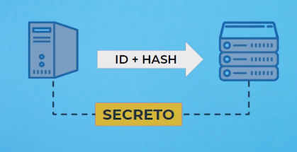

# API REST PHP<!-- omit in toc -->

## Tabla de Contenido<!-- omit in toc -->
- [Introducción a las APIS](#introducci%c3%b3n-a-las-apis)
- [Protocolo HTTP](#protocolo-http)
- [REST y RESTFull](#rest-y-restfull)
- [Consumo de servicios REST](#consumo-de-servicios-rest)
  - [Verbos HTTP](#verbos-http)
- [Ejecutar codigo y servidor PHP](#ejecutar-codigo-y-servidor-php)
- [Control de accesos](#control-de-accesos)
  - [Autenticación HTTP](#autenticaci%c3%b3n-http)
  - [Autenticación HMAC](#autenticaci%c3%b3n-hmac)
  - [Autenticación via access tokens](#autenticaci%c3%b3n-via-access-tokens)
- [Manejo de erores en REST](#manejo-de-erores-en-rest)
- [AJAX (Asincronismo)](#ajax-asincronismo)
- [Deploy](#deploy)
- [Buenas prácticas para APIS](#buenas-pr%c3%a1cticas-para-apis)

# Introducción a las APIS

API: Application Programming Interface (En español, interfaz de programación de aplicaciones), se trata de reglas que definen como interactúan dos aplicaciones y es un concepto que existe hace tiempo en el mundo de la programación.

<div align="center">
  
  <small><p>Api</p></small>
</div>

# Protocolo HTTP

REST se apoya en HTTP

HTTP son las siglas de Hypertext Transfer Protocol o protocolo de transferencia de hipertexto, es el conjunto de reglas en las que se van a comunicar dos entidades, en este caso dos computadoras.

Así como nosotros nos comunicamos en español gracias a poder mover las cuerdas vocales, producir y escuchar sonidos, las computadoras se pueden comunicar a través de HTTP gracias al modelo de TCP/IP.

<div align="center">
  
  <small><p>TCT/IP</p></small>
</div>

Muestra el html en consola
`curl https://wikipedia.com`

Muestra la comunicación por consola
`curl -v https://wikipedia.com`

# REST y RESTFull

REST es un acrónimo de Representational State Transfer o transferencia de estado representacional, le agrega una capa muy delgada de complejidad y abstracción a HTTP. Mientras que **HTTP es transferencia de archivos, REST se basa en la transferencia de recursos.**

Una API RESTful es una API diseñada con los conceptos de REST:
* Varbo HTTP
* Acción

Conceptos REST

* **Recurso:** todo dentro de una API RESTful debe ser un recurso. Libro, Autor, Genero
* **URI:** los recursos en REST siempre se manipulan a partir de la URI, identificadores universales de recursos.
* **Acción:** todas las peticiones a tu API RESTful deben estar asociadas a uno de los verbos de * HTTP: GET para obtener un recurso, POST para escribir un recurso, PUT para modificar un recurso y DELETE para borrarlo.
REST es muy útil cuando:
  * Las interacciones son simples.
  * Los recursos de tu hardware son limitados.
  * No conviene cuando las interacciones son muy complejas. Validación de documentos

Ejemplo

`GET /books/1`

# Consumo de servicios REST

<div align="center">
  
  <small><p>Consumo de servicios</p></small>
</div>

Ejemplo de API
https://xkcd.com/
`sudo apt-get install jq`
`curl https://xkcd.com/info.0.json | jq`

<div align="center">
  
  <small><p>Consumo de servicios</p></small>
</div>

## Verbos HTTP
* GET
* POST
* PUT
* DELETE

# Ejecutar codigo y servidor PHP

Levantar el Servidor
`php -S localhost:8000 server.php`

Ejecutar en otra terminal
```bash
curl http://localhost:8000 -v
curl http://localhost:8000/\?resource_type\=books
curl http://localhost:8000/\?resource_type\=books | jq
ver la comunicacion a través de los encabezados:
$ curl http://localhost:8000/\?resource_type\=books -v > /dev/null
consulta
$ curl "http://localhost:8000?resource_type=books&resource_id=1"
Método POST
//curl -X 'POST' http://localhost:8000/books -d '{"titulo":"Nuevo Libro","id_autor":1,"id_genero":2}'
Método Put - el recurso 1 será reemplazado por el libro que estoy creando
$ curl -X 'PUT' http://localhost:8000/books/1 -d '{"titulo": "Nuevo Libro", "id_autor": 1, "id_genero": 2}'
Método Delete
curl -X 'DELETE' http://localhost:8000/books/1
```

# Control de accesos

## Autenticación HTTP

<div align="center">
  
  <small><p>Autenticación</p></small>
</div>

La autenticación vía HTTP tiene dos problemas:

Es poco segura: las credenciales se envían en cada request anteponiendo el usuario y contraseña en la url, por ejemplo: user:password@platzi.com.
Es ineficiente: la autenticación se debe realizar en cada request.

## Autenticación HMAC

<div align="center">
  
  <small><p>Autenticación</p></small>
</div>

Para esta autenticación necesitamos 3 elementos:

* **Función Hash:** Difícil de romper, que sea conocida por el cliente y servidor.
* **Clave secreta:** Solamente la pueden saber el cliente y el servidor, será utilizada para corroborar el hash.
**UID:** El id del usuario, será utilizado dentro de la función hash junto con la clave secreta y un timestamp.
Es mucho más segura que la autenticación vía HTTP, por ello la información que se envía a través de este método no es muy sensible.

```bash
Inicio el servidor en la terminal 1
php -S localhost:8000 server.php

Terminal 2 ejecutar 
curl http://localhost:8000 -v
curl http://localhost:8000/\?resource_type\=books
curl http://localhost:8000/\?resource_type\=books | jq
```

## Autenticación via access tokens

<div align="center">
  
  <small><p>Autenticación</p></small>
</div>

Está forma es la más compleja de todas, pero también es la forma más segura utilizada para información muy sensible. El servidor al que le van a hacer las consultas se va a partir en dos:

* Uno se va a encargar específicamente de la autenticación.
* El otro se va a encargar de desplegar los recursos de la API.

El flujo de la petición es la siguiente:

Nuestro usuario hace una petición al servidor de autenticación para pedir un token.
El servidor le devuelve el token.
El usuario hace una petición al servidor para pedir recursos de la API.
El servidor con los recursos hace una petición al servidor de autenticación para verificar que el token sea válido.
Una vez verificado el token, el servidor le devuelve los recursos al cliente.

# Manejo de erores en REST
Los errores HTTP más comunes son los siguientes

**400 Bad Request:** indica que el servidor no puede o no procesa la petición debido a algo que es percibido como un error del cliente
**404 Not Found:** el servidor no encuentra el recurso solicitado.
**500 Internal Server Error:** la petición no pudo procesarse por un error del servidor.

Listado completo de códigos
https://www.restapitutorial.com/httpstatuscodes.html
https://httpstatuses.com/
https://http.cat/

# AJAX (Asincronismo)

Es muy común tener comunicaciones con API REST al momento de tener una aplicación de una sola página o SPA, ya sea para obtener o guardar datos. Esta comunicación se realiza a través de AJAX, Asynchronous JavaScript XML. la clave es la parte de asincronismo pues el cliente no se queda bloqueado.

# Deploy

https://zeit.co/home

# Buenas prácticas para APIS
Recuerda seguir las buenas prácticas:

* Siempre utiliza sustantivos para nombrar tus recursos.
* Añade los nombres en plural para las urls.
* Las modificaciones a recursos deben hacerse con su verbo HTTP correspondiente: POST, PUT o DELETE.
* Para devolver recursos asociados a otro recurso utiliza url que incorporen subrecursos: /Autos/1/Choferes.
* Navegabilidad vía vínculos.
* Cuando devuelvas colecciones deben ser filtrables, ordenables y paginables.
* Versiona tu API, añade el número de versión en la url: v1/Autos.