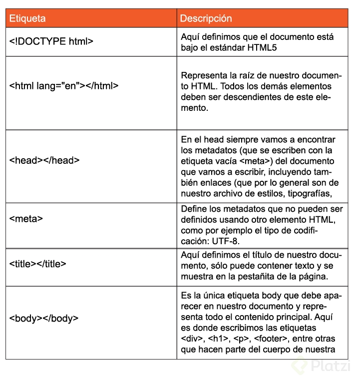

# Curso de Frontend Developer<!-- omit in toc -->

## Tabla de Contenido<!-- omit in toc -->
- [Recursos](#recursos)
- [Introducción](#introducci%c3%b3n)
- [HTML y CSS](#html-y-css)
  - [DOM, CSSOM, Render Tree y el proceso de renderizado de la Web](#dom-cssom-render-tree-y-el-proceso-de-renderizado-de-la-web)
- [HTML](#html)
  - [Anatomía de un Elemento HTML: Atributos, Anidamiento y Elementos vacíos](#anatom%c3%ada-de-un-elemento-html-atributos-anidamiento-y-elementos-vac%c3%ados)
  - [La importancia del código semántico](#la-importancia-del-c%c3%b3digo-sem%c3%a1ntico)
  - [Tipos de errores en HTML, debugging y servicio de validación de etiquetas](#tipos-de-errores-en-html-debugging-y-servicio-de-validaci%c3%b3n-de-etiquetas)
- [CSS](#css)
  - [Tipos de selectores, pseudo-clases y pseudo-elementos](#tipos-de-selectores-pseudo-clases-y-pseudo-elementos)
    - [Documentación](#documentaci%c3%b3n)
  - [Modelo de caja](#modelo-de-caja)
  - [Valores relativos y absolutos](#valores-relativos-y-absolutos)
  - [Displays en CSS](#displays-en-css)
  - [Funciones de las propiedades CSS más usadas](#funciones-de-las-propiedades-css-m%c3%a1s-usadas)
  - [Posicionamiento en CSS](#posicionamiento-en-css)
- [Arquitecturas de CSS](#arquitecturas-de-css)
  - [Buenas practicas.](#buenas-practicas)
  - [Metodologías CSS](#metodolog%c3%adas-css)
    - [OOCSS](#oocss)
    - [BEM](#bem)
    - [SMACSS](#smacss)
    - [ITCSS](#itcss)
    - [Atomic Design](#atomic-design)
- [Componentes](#componentes)
- [StoryBook for HTML](#storybook-for-html)

# Recursos
- <a href="https://www.freecodecamp.org/" target="_blank">FreeCodeCamp</a>
- <a href="https://www.teffcode.com/" target="_blank">Prefesora TeffCode</a>
- <a href="https://iconos8.es/" target="_blank">Recursos gráficos grátis</a>
- <a href="https://www.pexels.com/search/store/" target="_blank"> Imagenes gratis</a>

# Introducción

Algunos conceptos importantes y de historia

- Interconnnected Network
  - InterNET
- Tim Berners-LEE
  - WWW - W3C(Estandar)
    - HTTP - Protocolo de transferencia de Hiper Texto || Hyper Text Transfer Protocol
	- URL - Localizador de Recursos || Uniform Resource Locator,
	- HTML - Lenguaje de marcado de Hiper texto || Hyper Text Markup Language
	- CSS - {Hojas de estilo en cascada || Cascade Style Sheets
	- Responsive Desing - diseño web adaptativo o responsivo

# HTML y CSS
- **HTML:** Es un lenguaje de marcado usado para decirle a tu navegador cómo estructurar las páginas web que visitas. No es un lenguaje de programación.
  - <a href="https://htmlreference.io/" target="_blank">Referencia de HTML</a>
- **CSS:** Es un lenguaje que nos permite crear páginas web con un diseño agradable para los usuarios. Tampoco es un lenguaje de programación.
  - <a href="https://cssreference.io/" target="_blank">Referencia de CSS</a>

## DOM, CSSOM, Render Tree y el proceso de renderizado de la Web
- **DOM: Document Object Model.** Es una transformación del código HTML escrito por nosotros a objetos entendibles para el navegador.

- **CSSOM:** así como el DOM para el HTML, EL CSSOM es una representación de objetos de nuestros estilos en CSS.

- **Render Tree:** es la unión entre el DOM y el CSSOM para renderizar todo el código de nuestra página web.

Pasos que sigue el navegador para construir las páginas web:

Procesa el HTML para construir el DOM.
Procesa el CSS para construir el CSSOM.
El DOM se une con el CSSOM para crear el Render Tree.
Se aplican los estilos CSS en el Render Tree.
Se ““pintan”” los nodos en la pantalla para que los usuarios vean el contenido de la página web.

<div align="center">
  
  <small><p>Proceso de transformación del DOM</p></small>
</div>

<div align="center">
  
  <small><p>Proceso de transformación del CSSOM</p></small>
</div>

<div align="center">
  
  <small><p>Pasos del navegador</p></small>
</div>

<div align="center">
  
  <small><p>Pasos del navegador</p></small>
</div>

# HTML

## Anatomía de un Elemento HTML: Atributos, Anidamiento y Elementos vacíos

- **Etiqueta de apertura:** el nombre de nuestra etiqueta encerrado entre símbolos de mayor o menor. Por ejemplo: ``<h1>``.
Contenido: dentro de nuestras etiquetas podemos añadir texto u otros elementos HTML, *_lo que conocemos como anidamiento.
- **Etiqueta de cierre:** son casi iguales que las etiquetas de apertura, pero también **necesitan un slash (/)** antes del nombre de la etiqueta. Por ejemplo: ``</h1>``.

<div align="center">
  
  <small><p>Anatomia HTML</p></small>
</div>

Las etiquetas de apertura también pueden tener atributos. 

- Los atributos nos permiten definir características especiales para nuestros elementos: 

```html
<etiqueta atributo="valor del atributo">. 
<h1 class="saludo">.
```

También existen elementos vacíos. Estos elementos no tienen contenido ni etiqueta de cierre, solo etiqueta de apertura y atributos. Por ejemplo: 
```html
.
```

Estructura base

```html
<html lang="en">
<head>
  <meta charset="UTF-8">
  <meta name="viewport" content="width=device-width, initial-scale=1.0">
  <meta http-equiv="X-UA-Compatible" content="ie=edge">
  <title>Document</title>
</head>
<body>
  
</body>
</html>
```

Descripción:

<div align="center">
  
  <small><p>Estructura de un html</p></small>
</div>

Si por ejemplo queremos añadir en nuestro documento estilos o JavaScript, lo hacemos con las etiquetas ``<style>`` y ``<script>`` respectivamente, que a su vez deben ir dentro de la etiqueta raíz ``<html>``

Descripción de algunos elementos vacíos:

<div align="center">
  
  <small><p>Elementos vacios</p></small>
</div>

Descripción de las etiquetas semánticas para la estructura base de nuestra página:

<div align="center">
  
  <small><p>Elementos semanticos</p></small>
</div>

Descripción de otras etiquetas muy usadas:

<div align="center">
  
  <small><p>Etiquetas frecuentes</p></small>
</div>

## La importancia del código semántico
Es importante que como desarrolladores tengamos claro el significado de escribir código. Debes ser consciente de que la manera en la que codeas tenga sentido.

La semántica HTML no es más que darle sentido y estructura a lo que estas escribiendo. Muy importante para el navegador. No todos los elementos deberían ser un div.

## Tipos de errores en HTML, debugging y servicio de validación de etiquetas
**Errores sintácticos:** Son errores de escritura en el código y evitan que el programa funcione. Pueden ser errores de tipado.

**Errores lógicos:** En estos la sintaxis es correcta, pero el código no hace lo que debería. El programa funciona, pero de forma incorrecta.

HTML no detecta errores. Sin embargo, con VSCode puedes instalar HTML5 Hint para detectar problemas.

# CSS
## Tipos de selectores, pseudo-clases y pseudo-elementos
- ***(asterisco):** Es el selector universal. Las propiedades se aplicaran a todos los elementos de nuestro HTML.
- **Tipo:** Son selectores que se aplican a cierto elemento HTML en específico. Las propiedades se aplicaran a la etiqueta que queremos, por ejemplo p, body, html, div, etc.
- **Clase:** Si nuestras etiqueta de HTML tienen un atributo de class podemos usar ese valor o identificador para que los cambios en el CSS afecten únicamente a ese elemento.
- **ID:** Es similar al anterior, si la etiqueta HTML tiene un ID podemos afectar solo ese elemento.

Las **Pseudo-clases y Pseudo-elementos** nos permiten ser aún más específicos con qué elemento o partes de nuestros elementos deben recibir los estilos.

Para usarlas debemos definir el selector base (por ejemplo, p) seguido de dos puntos y la pseudo-clase que queremos estilizar (por ejemplo: p:first-child). En el caso de los pseudo-elementos debemos usar el dos puntos 2 veces (p::first-letter).

```css
/* Asterisco (universal) */
* {
  margin: 0;
}

/* Tipo */
h1 {
  color: red;
}

/* Clase */
.saludo {
  font-size: 2em;
}

/* ID */
#id {
  border-radius: 20px;
}

/* Pseudo-clases */
p:first-child {
  color: white;
}

p:last-child {
  color: purple;
}

p:nth-child(2n) {
  color: red;
}

p:nth-child(2n+1) {
  color: blue;
}

p::first-letter{
    color: red;
    font-size: 36px;
}
```

### Documentación
<a href="https://developer.mozilla.org/en-US/docs/Web/CSS/Pseudo-classes">Pseudo-clases</a>
<a href="https://developer.mozilla.org/en-US/docs/Web/CSS/Pseudo-elements">Pseudo-elementos</a>

## Modelo de caja
Todos los elementos de HTML tienen un modelo de caja y esta compuesto por cuatro elementos: contenido, padding, border, margin.

<a href="https://colorhunt.co" target="_blank"> Paletas de colores ColorHunt</a>
<a href="https://coolors.co" target="_blank"> Paletas de colores Coolors</a>
<a href="https://picular.co/video" target="_blank"> Paletas de colores Picular</a>
<a href="http://paletton.com/#uid=1000u0kllllaFw0g0qFqFg0w0aF" target="_blank"> Paletas de colores Paleton</a>

## Valores relativos y absolutos
**Los valores absolutos** son, por ejemplo, centímetros, milímetros, pixeles y pulgadas. Se llaman de esta forma porque no tienen en cuenta a nadie más, no depende de la medida de otra unidad.

**Los valores relativas**, llevan este nombre porque depende de otra unidad de medida o elemento. Por ejemplo, porcentajes, vmx, em, entre otros.

Podemos darle estilos a etiquetas HTML muy específicas indicando dónde se van a encontrar. Por ejemplo: si queremos darle estilos únicamente a la imagen que está dentro del header, podemos usar el selector css header img { ... }.


## Displays en CSS

Todos los elementos en CSS son cuadrados o rectángulos y aparte de eso, estos elementos tienen un comportamiento que se define a través de la propiedad display. Los display más comunes y usados son: block, inline, inline-block, none, table, flex y grid. 

<div align="center">
  
  <small><p>Display CSS</p></small>
</div>

<a href="https://css-tricks.com/snippets/css/a-guide-to-flexbox/">Guia para Flexbox</a>
<a href="https://css-tricks.com/snippets/css/complete-guide-grid/">Guia para CSS Grid</a>

## Funciones de las propiedades CSS más usadas

<div align="center">
  
  <small><p>Propiedades CSS</p></small>
</div>

Transiciones
https://css-tricks.com/almanac/properties/t/transition/
https://www.w3schools.com/css/css3_transitions.asp
https://developer.mozilla.org/en-US/docs/Web/CSS/CSS_Transitions/Using_CSS_transitions

Animaciones
https://css-tricks.com/almanac/properties/a/animation/
https://www.w3schools.com/css/css3_animations.asp
https://developer.mozilla.org/en-US/docs/Web/CSS/CSS_Animations/Using_CSS_animations

## Posicionamiento en CSS

El posicionamiento en CSS es una de las cosas más importantes, pues establece cómo van a estar ubicados nuestros elementos en la pantalla.

En CSS los elementos se posicionan utilizando las propiedades top (superior), bottom (inferior), left (izquierda) y right (derecha), pero sólo funcionarán si la propiedad position está establecida. Esto quiere decir que si quiero que mi elemento div esté completamente a la derecha, debo escribir en mi CSS lo siguiente:

``div { position: absolute: right: 0px; }``

La propiedad position tiene 7 valores diferentes: relative, absolute, fixed, sticky, static, initial e inherit. Veremos de qué se tratan:

<div align="center">
  
  <small><p>Posiciones CSS</p></small>
</div>

# Arquitecturas de CSS

- Predecibles.
- Reutilizable
- Mantenible
- Escalable

## Buenas practicas.
- Establecer reglas
- Explicar la estructura base
- Establecer estándares de codificación
- Evitar largas hojas de estilo
- Documentación

## Metodologías CSS 
Es orientada a objetos y separa el diseño del contenido

### OOCSS 

<div align="center">
  
  <small><p>OOCSS</p></small>
</div>

```html
<!DOCTYPE html>
<html lang="en">
<head>
    <meta charset="UTF-8">
    <meta name="viewport" content="width=device-width, initial-scale=1.0">
    <meta http-equiv="X-UA-Compatible" content="ie=edge">
    <title>Document</title>
</head>
<style>
    .globalwith{
        width: 100%;
    }
    .header{

    }
    .footer{

    }
</style>
<body>
    <header class="header globalwith">

    </header>
    <footer class="footer globalwith">

    </footer>
</body>
</html>
```

https://www.smashingmagazine.com/2011/12/an-introduction-to-object-oriented-css-oocss/

### BEM 
Block Element Modified, separa los bloques, elementos y modificadores

<div align="center">
  
  <small><p>BEM</p></small>
</div>

```html
<header class="header">
    <button class="header__button--red">
        Red
    </button>
    <button class="header__button--yellow">
        Yellow
    </button>
</header>
```

http://getbem.com/introduction/

### SMACSS
Arquitectura CSS escalable y modular

<div align="center">
  
  <small><p>Smacks</p></small>
</div>

http://smacss.com/

### ITCSS
Triangulo invertido de CSS, dividir por partes el contenido

<div align="center">
  
  <small><p>ITCSS</p></small>
</div>

https://www.xfive.co/blog/itcss-scalable-maintainable-css-architecture/

### Atomic Design
Se basá en la química, tomando atómos

<div align="center">
  
  <small><p>Atomic Design</p></small>
</div>

https://bradfrost.com/blog/post/atomic-web-design/

# Componentes

Un componente, tanto en diseño como desarrollo web, es un elemento muy pequeño que tiene la capacidad de ser reutilizado en diferentes partes de una aplicación. Por ejemplo: botones, iconos, cards, entre otras. Puedes apreciarlos en las plataformas que visitas todos los días: Twitter, Facebook, Platzi, YouTube y muchas más.

# StoryBook for HTML
https://storybook.js.org/docs/guides/guide-html/