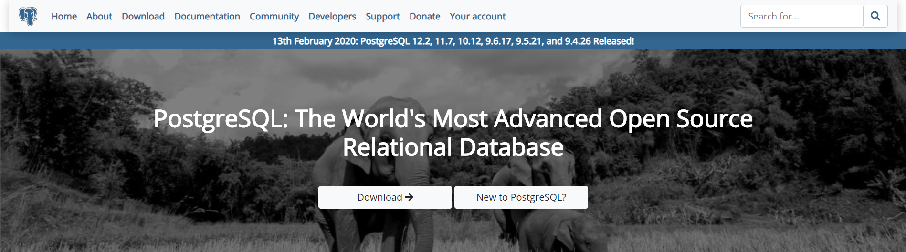
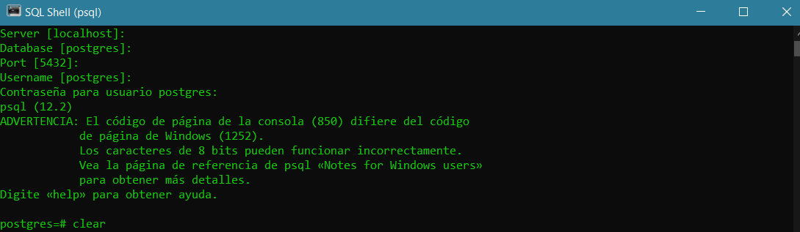
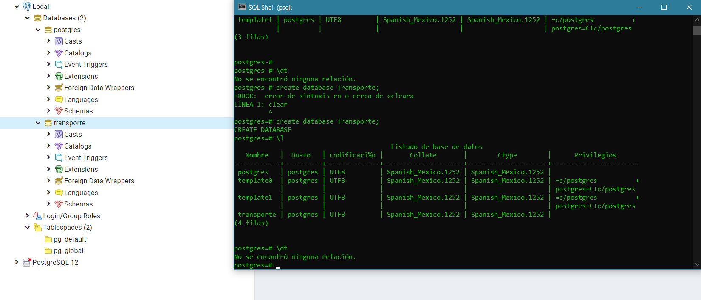

# Fundamentos de bases de datos<!-- omit in toc -->

## Tabla de Contenido<!-- omit in toc -->
- [Introducción](#introducci%c3%b3n)
  - [Instalación](#instalaci%c3%b3n)
- [PostgreSQL](#postgresql)
  - [Consola de comandos](#consola-de-comandos)

# Introducción

  
  <small>
Postgress
</small>

 Es un sistema de gestión de bases de datos relacional orientado a objetos y de código abierto, publicado bajo la licencia PostgreSQL,​ similar a la BSD o la MIT.

Características
* Open Source
* Objeto-Relacional
* Usa SQL
* Se creo en 1986
* PostGIS Servicio de geolocalización para procesar mapas y puntos
* PL/PgSQL Lenguaje dentro de la base de datos

Estandart ACID
* Atomicity - Atomicidad | Desarrollar las funciones en pequeñas tareas y hacer que funcionen como un todo
* Consistency - Consistencia | Los datos son congruentes
* Isolation - Aislamiento | Se pueden tener varias tareas al mismo tiempo, aislando las funciones que se realizan
* Durabiliad - Durabilidad | Seguridad de que la información no se va a perder

Por que PostgreSQL
* Tipos de datos
* Integridad de datos
* Concurrencia. Rendimiento
* Fiabilidad
* Seguridad
* Extensibilidad
* Internacionalidazación y búsquedas de texto

## Instalación

Descarga
https://www.postgresql.org/

# PostgreSQL

## Consola de comandos
Abrir SQL Shell (pgsql)

  
  <small>
Consola pgsql
</small>

Crear base de datos
``create database Transporte;``

> No olvides el **;**

Listar bases de datos
`\l`

  
  <small>
PGAdmin & Shell Console
</small>

Acceder a una base de datos

`\c transporte`

Ver tablas
`\dt`

Describir una tabla
``\d viajero``

Ver comandos de SQL que podemos hacer en la base de datos
``\h``

Version de Postgress
``SELECT version();``

Muestra lo que se está haciendo en la bd
``\g``

Activa el tiempo de ejecución de comandos
``\timing``