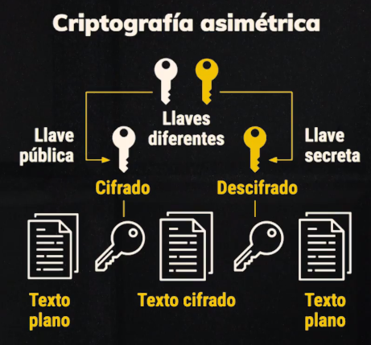

# Curso de PreWork<!-- omit in toc -->

## Tabla de Contenido<!-- omit in toc -->
- [Línea de comandos](#l%c3%adnea-de-comandos)
  - [Manejo de archivos y directorios](#manejo-de-archivos-y-directorios)
  - [LLavez SSH](#llavez-ssh)
  - [Instalar subsistema de LINUX en WIndows](#instalar-subsistema-de-linux-en-windows)
  - [Consola universal Hyper](#consola-universal-hyper)
- [Instalar Zsh](#instalar-zsh)
- [Instalar NodeJS](#instalar-nodejs)
- [Instalar VSCode](#instalar-vscode)
  - [NPM y NPX](#npm-y-npx)
  - [Plugins Google Chrome para ReactJS](#plugins-google-chrome-para-reactjs)
  - [Herramientas para Backend](#herramientas-para-backend)
- [¿Qué es GIT?](#%c2%bfqu%c3%a9-es-git)


# Línea de comandos
La terminal es la herramienta más poderosa para un desarrollador. Cambia un poco dependiendo del sistema operativo, puede ser:

- Unix: sistema operativo en el que se basa Mac y Linux.
- Windows.

<div align="right">
  <small><a href="#tabla-de-contenido">🡡 volver al inicio</a></small>
</div>

## Manejo de archivos y directorios
Vamos a ver diferentes comandos que nos serán de gran utilidad:

**ls**: Nos permite listar los archivos y directorios que se encuentren dentro de la carpeta en la que estamos ubicados, podemos pasarle distintos parámetros a este comando:
- **-a** podemos ver los archivos ocultos.
- **-l** nos lista los contenidos mostrando sus permisos y propietarios.
- **-t** nos lista los contenidos según su fecha.

**clear:** Nos limpia la pantalla.
**pwd:** Nos retorna la ruta absoluta en la cual nos encontramos.
**mkdir:** Crea una carpeta.
**cd:** Nos mueve a alguna carpeta que le indiquemos, dentro de los archivos ocultos vimos que existe:
**.:** Refiere a la carpeta en la cual estamos ubicados.
**..:** Se refiere a la carpeta padre en la cual nos encontramos.
**history:** Muestra el histórico de todos los comandos que hemos ejecutado.
**touch:** Crea un archivo vacío con el nombre que le indiquemos.
**nano:** Es un editor dentro de la consola, podemos abrir cualquier archivo y modificarlo.
**mv:** Permite mover archivos entre distintas carpetas, solamente debemos indicarle el nombre del archivo y la ruta de destino.
**rm:** Elimina únicamente un archivo, añadiendo el parámetro -rf podemos eliminar directorios también.
**cat:** permite visualizar un archivo completo en la terminal.
**more:** muestra por partes un archivo dentro de la terminal.
**tail:** muestra las últimas 10 líneas de cada archivo, se puede modificar pasándole el parámetro con el número de líneas **-15**.
**open:** abre un archivo con el programa que tengamos por defecto.

## LLavez SSH

Las llaves SSH nos van a ayudar para autentificarnos con servidores. SSH utiliza criptografía asimétrica, o sea, tenemos dos llaves:

**Pública:** la llave pública la podemos compartir por internet.
**Privada:** debes tenerla en un sitio seguro y no debe ser compartida.
Tener una llave SSH nos permitirá una conexión fácil y segura con servidores.

Para crear una llave SSH utilizamos el siguiente comando:
(RSA) Rivest, Shamir y Adleman son los creadores del algoritmo
```shell
ssh-keygen -t rsa -b 4096 -C llave, puede ser tu correo> 
```

<div align="center">
  
  <small><p>Funcionamiento del cifrado asimétrico</p></small>
</div>

## Instalar subsistema de LINUX en WIndows
<a href="https://docs.microsoft.com/en-us/windows/wsl/install-win10">Documentación oficial</a>

## Consola universal Hyper
<a href="https://hyper.is/">Consola universal hyper</a>

# Instalar Zsh
Z shell (o simplemente zsh) es un potente intérprete de comandos para sistemas operativos de tipo Unix, como por ejemplo los BSD o GNU/Linux.1​ La primera versión de zsh fue escrita por Paul Falstad en 1990, cuando era estudiante en la Universidad de Princeton.

Tiene muchas similitudes con bash y ksh e incorpora muchas de sus características principales. Algunas de sus ventajas principales incluyen una lista de autocompletar navegable. A diferencia de bash, que únicamente lista los comandos disponibles.

- Eficiencia
- Completado de tabulador mejorado
- Expansión de nombres de fichero mejorada
- Manejo de arrays mejorado
- Totalmente personalizable

Para instalar en windows, mediante el subsistema de windows hacer los siguiente:

```shell
sudo apt-get install zsh
```

Instalar ohmyzsh

```shell
curl -Lo install.sh https://raw.githubusercontent.com/ohmyzsh/ohmyzsh/master/tools/install.sh
sh install.sh
```

Volver consola por defecto

```shell
chsh -s /usr/bin/zsh
```

Actualizar configuración de hyper
`notepad preferences`
```
  shell: 'C:\\Windows\\System32\\bash.exe',
```

# Instalar NodeJS
La instalación de la herramienta se instala dentro del subsistema de Linux Ubuntu

```shell
curl -sL https://deb.nodesource.com/setup_13.x | sudo -E bash -
sudo apt-get install -y nodejs
```
# Instalar VSCode
Algunos plugins utiles para JS
<a href="https://code.visualstudio.com/">Sitio oficial de VsCode</a>

- Git Blame: va a mostrar el autor de la línea de código en la que estemos trabajando.
- ESLint: es una herramienta de análisis de código estático para identificar patrones problemáticos encontrados en el código JavaScript, o sea, nuestro linter. Debemos instalar y configurar eslint para que siga el estilo de código que le indiquemos.
- Color Highlight: resalta el color que estemos escribiendo.
- SASS: es un preprocesador de CSS.

Para instalar EsLint ejecutar:
```shell
npm install -g eslint
```

Para configurarlo
```shell
npx eslint --init
```

## NPM y NPX
`NPX viene con NPM`
- **NPM** - Administra paquetes pero no hace la vida fácil ejecutando cualquiera.
- **NPX** - Una herramienta para ejecutar paquetes de node.

NPM por sí solo no ejecuta ningún paquete. de hecho, no ejecuta ningún paquete. Si desea ejecutar un paquete utilizando NPM, debe especificar ese paquete en su archivo packages.json.

Cuando los ejecutables se instalan a través de paquetes NPM, NPM los vincula con ellos:

- **local** las instalaciones tienen "enlaces" creados en el directorio ./node_modules/.bin/.
- **global** las instalaciones tienen "enlaces" creados desde el directorio global bin/ (por ejemplo, /usr/local/bin) en Linux o en %AppData%/npm en Windows.

## Plugins Google Chrome para ReactJS
<a href="https://chrome.google.com/webstore/detail/react-developer-tools/fmkadmapgofadopljbjfkapdkoienihi">React Developer Tools</a>
<a href="https://chrome.google.com/webstore/detail/react-developer-tools/fmkadmapgofadopljbjfkapdkoienihi">Redux DevTools</a>

## Herramientas para Backend

<a href="https://chrome.google.com/webstore/detail/json-viewer/gbmdgpbipfallnflgajpaliibnhdgobh">JSON Viewer</a>
<a href="https://www.getpostman.com/">Postman</a>

URL para probar JSONs
http://jsonplaceholder.typicode.com/todos

# ¿Qué es GIT?
Git es un sistema de control de versiones que nos permite llevar un histórico sobre los cambios de nuestro proyecto, no es el único sistema de control de versiones, pero sí el más usado. Fue creado por **Linus Torvalds**. **Git y GitHub no son lo mismo**, uno es el sistema de control de versiones y el otro es la red social de programadores.

Los repositorios son una estructura de datos que almacenan información sobre archivos y directorios. Es el inicio de todo proyecto con Git, **dentro de un repositorio encontraremos ramas**, no son más que la duplicación de un objeto bajo un repositorio, permite trabajar en paralelo para al final unir los cambios.

